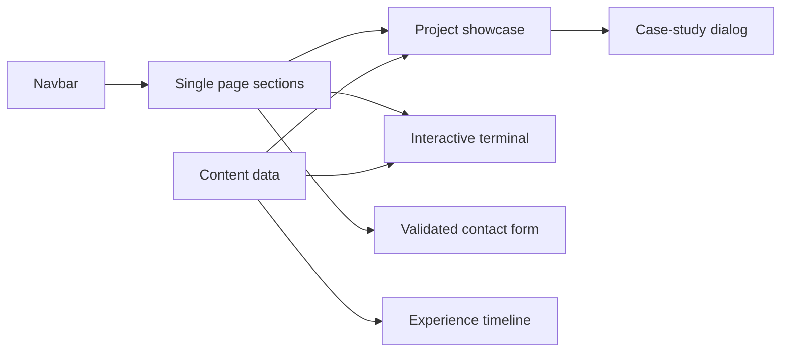

# Direction

Build a dark-first, SaaS-grade portfolio that uses product storytelling instead of conventional card grids. A complete light theme remains available through the navigation control.

## Product decisions

| Area | Decision | Reason |
|---|---|---|
| Visual language | Near-black canvas, lime/electric accent, restrained glass and grid texture | Gives the site a technical, premium identity without visual noise |
| Interaction | Motion is purposeful: enter-on-scroll, cursor affordances, terminal commands, magnetic controls and project focus | Makes the work feel demonstrably product-minded while remaining fast |
| Content structure | One single-page experience with project-detail overlays | Maintains a strong narrative and makes project deep-dives accessible without breaking flow |
| Contact | Client-side validation and simulated delivery states | Honest, complete UX without inventing an external endpoint |
| Accessibility | Semantic landmarks, keyboard-operable UI, visible focus states, reduced-motion fallback | Keeps the polished treatment usable rather than decorative |

## Architecture

The Next.js app uses composable section components and a shared data layer for technologies, projects, milestones and terminal responses. Project details render in an accessible modal; its data has the same shape a dedicated `/projects/[slug]` page would consume later. Theme state is local and persisted at the document level. Decorative motion is disabled or simplified for reduced-motion preferences.

## Failure handling

- Contact submission uses a clearly labeled local success state and exposes validation errors inline.
- Modal and mobile navigation close with Escape and retain their state predictably.
- Heavy motion has a non-animated equivalent; cursor effects are desktop-only.
- Project visuals are CSS-native rather than stock imagery, avoiding external image failure and protecting performance.
